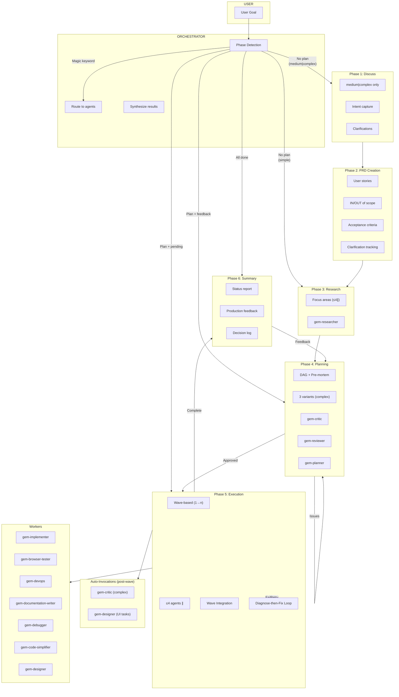

# Gem Team

> A modular, high-performance multi-agent orchestration framework for spec-driven development, feature implementation, and automated verification.

[](https://awesome-copilot.github.com/plugins/#file=plugins%2Fgem-team)


---

## Why Gem Team?

### Single-Agent Problems → Gem Team Solutions

| Problem | Solution |
|:--------|:---------|
| Context overload | **Specialized agents** with focused expertise |
| No specialization | **12 expert agents** with clear roles and zero overlap |
| Sequential bottlenecks | **DAG-based parallel execution** (≤4 agents simultaneously) |
| Missing verification | **TDD + mandatory verification gates** per agent |
| Intent misalignment | **Discuss phase** captures intent; **clarification tracking** in PRD |
| No audit trail | Persistent **`plan.yaml` and `PRD.yaml`** tracks every decision & outcome |
| Over-engineering | **Architectural gates** validate simplicity; **gem-critic** challenges assumptions |
| Untested accessibility | **WCAG spec validation** (designer) + **runtime checks** (browser tester) |
| Blind retries | **Diagnose-then-fix**: gem-debugger finds root cause, gem-implementer applies fix |
| Single-plan risk | Complex tasks get **3 planner variants** → best DAG selected automatically |
| Missed edge cases | **gem-critic** audits for logic gaps, boundary conditions, YAGNI violations |
| Slow manual workflows | **Magic keywords** (`autopilot`, `simplify`, `critique`, `debug`, `fast`) skip to what you need |
| Docs drift from code | **gem-documentation-writer** enforces code-documentation parity |
| Unsafe deployments | **Approval gates** block production/security changes until confirmed |
| Browser fragmentation | **Multi-browser testing** via Chrome MCP, Playwright, and Agent Browser |
| Broken contracts | **Contract verification** post-wave ensures dependent tasks integrate correctly |

### Why It Works

- **10x Faster** — Parallel execution eliminates bottlenecks
- **Higher Quality** — Specialized agents + TDD + verification gates = fewer bugs
- **Built-in Security** — OWASP scanning on critical tasks
- **Full Visibility** — Real-time status, clear approval gates
- **Resilient** — Pre-mortem analysis, failure handling, auto-replanning
- **Pattern Reuse** — Codebase pattern discovery prevents reinventing wheels
- **Self-Correcting** — All agents self-critique at 0.85 confidence threshold before returning results
- **Accessibility-First** — WCAG compliance validated at both spec and runtime layers
- **Smart Debugging** — Root-cause analysis with stack trace parsing, regression bisection, and confidence-scored fix recommendations
- **Safe DevOps** — Idempotent operations, health checks, and mandatory approval gates for production
- **Traceable** — Self-documenting IDs link requirements → tasks → tests → evidence
- **Decision-Focused** — Research outputs highlight blockers and decision points for planners
- **Rich Specification Creation** — PRD creation with user stories, IN/OUT of scope, acceptance criteria, and clarification tracking
- **Spec-Driven Development** — Specifications define the "what" before the "how", with multi-step refinement rather than one-shot code generation from prompts

---

## Installation

```bash
# Using Copilot CLI
copilot plugin install gem-team@awesome-copilot
```

> **[Install Gem Team Now →](https://aka.ms/awesome-copilot/install/agent?url=vscode%3Achat-agent%2Finstall%3Furl%3Dhttps%253A%252F%252Fraw.githubusercontent.com%252Fgithub%252Fawesome-copilot%252Fmain%252F.%252Fagents)**

---

## Architecture



---

## Core Workflow

The Orchestrator follows a 6-phase workflow with automatic phase detection.

### Phase Detection

| Condition | Action |
|:----------|:-------|
| No plan + simple | Research Phase (skip Discuss) |
| No plan + medium\|complex | Discuss Phase |
| Plan + pending tasks | Execution Loop |
| Plan + feedback | Planning |
| All tasks done | Summary |
| Magic keyword | Fast-track to specified agent/mode |

### Phase 1: Discuss (medium|complex only)

- **Identifies gray areas** → 2-4 context-aware options per question
- **Asks 3-5 targeted questions** → Architectural decisions → `AGENTS.md`
- **Task clarifications** captured for PRD creation

### Phase 2: PRD Creation

- **Creates** `docs/PRD.yaml` from Discuss Phase outputs
- **Includes:** user stories, IN SCOPE, OUT OF SCOPE, acceptance criteria
- **Tracks clarifications:** status (open/resolved/deferred) with owner assignment

### Phase 3: Research

- **Detects complexity** (simple/medium/complex)
- **Delegates to gem-researcher** (≤4 concurrent) per focus area
- **Output:** `docs/plan/{plan_id}/research_findings_{focus}.yaml`

### Phase 4: Planning

- **Complex:** 3 planner variants (a/b/c) → selects best
- **gem-reviewer** validates with architectural checks (simplicity, anti-abstraction, integration-first)
- **gem-critic** challenges assumptions
- **Planning history** tracks iteration passes for continuous improvement
- **Output:** `docs/plan/{plan_id}/plan.yaml` (DAG + waves)

### Phase 5: Execution

- **Executes in waves** (wave 1 first, wave 2 after)
- **≤4 agents parallel** per wave (6-8 with `fast`/`parallel` keyword)
- **TDD cycle:** Red → Green → Refactor → Verify
- **Contract-first:** Write contract tests before implementing tasks with dependencies
- **Wave integration:** get_errors → build → lint/typecheck/tests → contract verification
- **On failure:** gem-debugger diagnoses → root cause injected → gem-implementer retries (max 3)
- **Prototype support:** Wave 1 can include prototype tasks to validate architecture early
- **Auto-invocations:** gem-critic after each wave (complex); gem-designer validates UI tasks post-wave

### Phase 6: Summary

- **Decision log:** All key decisions with rationale (backward reference to requirements)
- **Production feedback:** How to verify in production, known limitations, rollback procedure
- **Presents** status, next steps
- **User feedback** → routes back to Planning

---

## The Agent Team

| Agent | Role | When to Use |
|:------|:-----|:------------|
| `gem-orchestrator` | **ORCHESTRATOR** | Coordinates multi-agent workflows, delegates tasks. Never executes directly. |
| `gem-researcher` | **RESEARCHER** | Research, explore, analyze code, find patterns, investigate dependencies. Decision-focused output with blockers highlighted. |
| `gem-planner` | **PLANNER** | Plan, design approach, break down work, estimate effort. Supports prototype tasks, planning passes, and multiple iterations. |
| `gem-implementer` | **IMPLEMENTER** | Implement, build, create, code, write, fix (TDD). Uses contract-first approach for tasks with dependencies. |
| `gem-browser-tester` | **BROWSER TESTER** | Test UI, browser tests, E2E, visual regression, accessibility. |
| `gem-devops` | **DEVOPS** | Deploy, configure infrastructure, CI/CD, containers. |
| `gem-reviewer` | **REVIEWER** | Review, audit, security scan, compliance. Never modifies. Performs architectural checks and contract verification. |
| `gem-documentation-writer` | **DOCUMENTATION** | Document, write docs, README, API docs, diagrams. |
| `gem-debugger` | **DEBUGGER** | Debug, diagnose, root cause analysis, trace errors. Never fixes. |
| `gem-critic` | **CRITIC** | Critique, challenge assumptions, edge cases, over-engineering. |
| `gem-code-simplifier` | **SIMPLIFIER** | Simplify, refactor, dead code removal, reduce complexity. |
| `gem-designer` | **DESIGNER** | Design UI, create themes, layouts, validate accessibility. |

---

## Key Features

| Feature | Description |
|:--------|:------------|
| **TDD (Red-Green-Refactor)** | Tests first → fail → minimal code → refactor → verify |
| **Security-First** | OWASP scanning, secrets/PII detection, tiered depth review |
| **Pre-Mortem Analysis** | Failure modes identified BEFORE execution |
| **Multi-Plan Selection** | Complex tasks: 3 planner variants → selects best DAG |
| **Wave-Based Execution** | Parallel agent execution with integration gates |
| **Diagnose-then-Fix** | gem-debugger finds root cause → injects diagnosis → gem-implementer fixes |
| **Approval Gates** | Security + deployment approval for sensitive ops |
| **Multi-Browser Testing** | Chrome MCP, Playwright, Agent Browser |
| **Codebase Patterns** | Avoids reinventing the wheel |
| **Self-Critique** | Reflection step before output (0.85 confidence threshold) |
| **Root-Cause Diagnosis** | Stack trace analysis, regression bisection |
| **Constructive Critique** | Challenges assumptions, finds edge cases |
| **Magic Keywords** | Fast-track modes: `autopilot`, `simplify`, `critique`, `debug`, `fast` |
| **Docs-Code Parity** | Documentation verified against source code |
| **Contract-First Development** | Contract tests written before implementation |
| **Self-Documenting IDs** | Task/AC IDs encode lineage for traceability |
| **Architectural Gates** | Plan review validates simplicity & integration-first |
| **Prototype Wave** | Wave 1 can validate architecture before full implementation |
| **Planning History** | Tracks iteration passes for continuous improvement |
| **Clarification Tracking** | PRD tracks unresolved items with ownership |

---

## Knowledge Sources

All agents consult in priority order:

| Source | Description |
|:-------|:------------|
| `docs/PRD.yaml` | Product requirements — scope and acceptance criteria |
| Codebase patterns | Semantic search for implementations, reusable components |
| `AGENTS.md` | Team conventions and architectural decisions |
| Context7 | Library and framework documentation |
| Official docs | Guides, configuration, reference materials |
| Online search | Best practices, troubleshooting, GitHub issues |

---

## Generated Artifacts

| Agent | Generates | Path |
|:------|:----------|:-----|
| gem-orchestrator | PRD | `docs/PRD.yaml` |
| gem-planner | plan.yaml | `docs/plan/{plan_id}/plan.yaml` |
| gem-researcher | findings | `docs/plan/{plan_id}/research_findings_{focus}.yaml` |
| gem-critic | critique report | `docs/plan/{plan_id}/critique_{scope}.yaml` |
| gem-browser-tester | evidence | `docs/plan/{plan_id}/evidence/{task_id}/` |
| gem-designer | design specs | `docs/plan/{plan_id}/design_{task_id}.yaml` |
| gem-code-simplifier | change log | `docs/plan/{plan_id}/simplification_{task_id}.yaml` |
| gem-debugger | diagnosis | `docs/plan/{plan_id}/logs/{agent}_{task_id}_{timestamp}.yaml` |
| gem-documentation-writer | docs | `docs/` (README, API docs, walkthroughs) |

---

## Agent Protocol

### Core Rules

- Output ONLY requested deliverable (code: code ONLY)
- Think-Before-Action via internal `<thought>` block
- Batch independent operations; context-efficient reads (≤200 lines)
- Agent-specific `verification` criteria from plan.yaml
- Self-critique: agents reflect on output before returning results
- Knowledge sources: agents consult prioritized references (PRD → codebase → AGENTS.md → Context7 → docs → online)

### Verification by Agent

| Agent | Verification |
|:------|:-------------|
| Implementer | get_errors → typecheck → unit tests → contract tests (if applicable) |
| Debugger | reproduce → stack trace → root cause → fix recommendations |
| Critic | assumption audit → edge case discovery → over-engineering detection → logic gap analysis |
| Browser Tester | validation matrix → console → network → accessibility |
| Reviewer (task) | OWASP scan → code quality → logic → task_completion_check → coverage_status |
| Reviewer (plan) | coverage → atomicity → deps → PRD alignment → architectural_checks |
| Reviewer (wave) | get_errors → build → lint → typecheck → tests → contract_checks |
| DevOps | deployment → health checks → idempotency |
| Doc Writer | completeness → code parity → formatting |
| Simplifier | tests pass → behavior preserved → get_errors |
| Designer | accessibility → visual hierarchy → responsive → design system compliance |
| Researcher | decision_blockers → research_blockers → coverage → confidence |

---

## Contributing

Contributions are welcome! Please feel free to submit a Pull Request.

## License

This project is licensed under the MIT License.

## Support

If you encounter any issues or have questions, please [open an issue](https://github.com/mubaidr/gem-team/issues) on GitHub.
